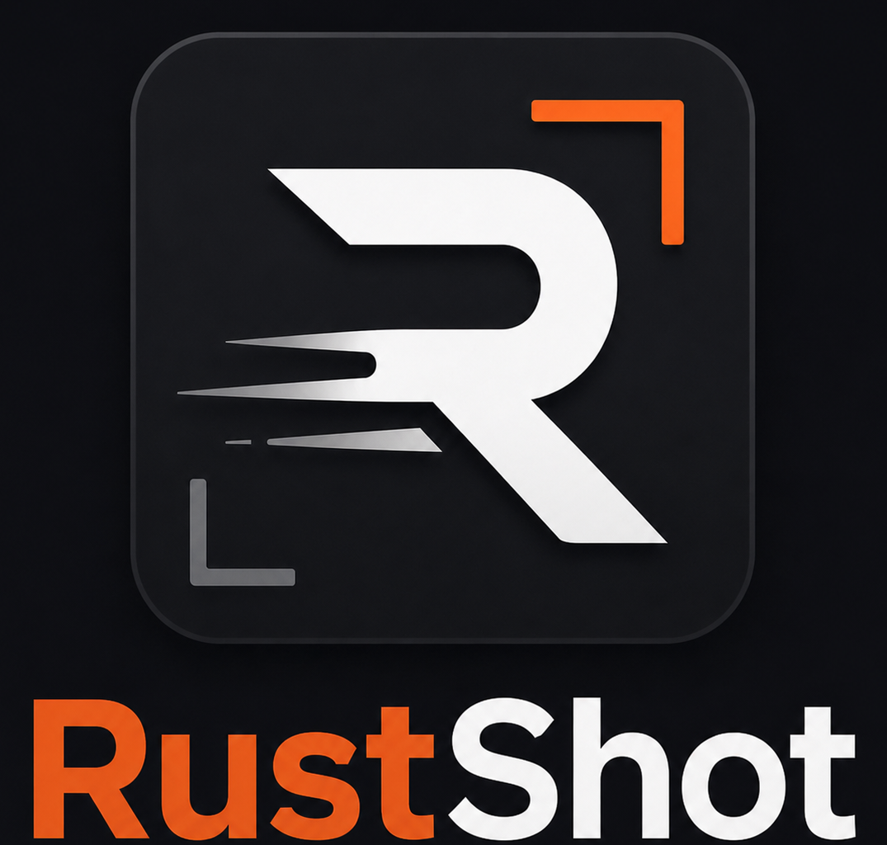

<p align="center">
  
</p>

<p align="center">
  <a href="https://github.com/CodyKoInABox/rustshot/actions/workflows/ci.yml"></a>
  
  <a href="LICENSE"></a>
</p>

RustShot is a fast, lightweight screenshot and annotation tool for Windows. It combines familiar
region capture with a native editor, configurable global shortcuts, automatic workflows, and
low-overhead tray operation.

## Download

RustShot is distributed through [GitHub Releases](https://github.com/CodyKoInABox/rustshot/releases)
as a portable 64-bit Windows application. No installer is required: extract the ZIP and run
`rustshot.exe` on Windows 10 or Windows 11.

## Highlights

- Full-screen capture for the monitor under the pointer or the complete virtual desktop.
- Resizable region selection with move and edge controls.
- Pen, highlighter, line, arrow, rectangle, ellipse, text, and callout tools.
- Secure redaction, pixelation, crop, object editing, and undo/redo.
- Lossless clipboard export, PNG/JPEG saving, and native printing.
- Optional automatic copy and automatic save after region selection.
- Configurable global shortcuts and remembered editor preferences.
- Native Windows interface with no browser or webview runtime.
- Local-only operation with no telemetry or upload service.

## Quick start

RustShot starts in the system tray. The default shortcuts are:

| Shortcut | Action |
| --- | --- |
| `Ctrl+Shift+F10` | Select and edit a region |
| `Ctrl+Shift+F11` | Capture and save the current monitor |

The tray menu provides capture commands, the screenshots folder, settings, diagnostics, and quit.
Shortcuts, output format, monitor scope, cursor capture, automatic copy, and automatic save are all
configurable from **Settings**.

## Region editor

After selecting a region, annotations remain editable until export.

| Key | Action |
| --- | --- |
| `V` | Select, move, resize, or restyle an object |
| `P`, `H`, `L`, `A` | Pen, highlighter, line, arrow |
| `R`, `E` | Rectangle, ellipse |
| `T`, `Q` | Text box, callout; `Shift+Enter` inserts a line break |
| `B`, `M` | Secure redaction, pixelation |
| `D` / `Delete` | Delete the object under the pointer or selected object |
| `G` | Crop the captured region |
| `I`, `K` | Eyedropper, custom color picker |
| `U` / `Ctrl+Z` | Undo |
| `Y` / `Ctrl+Y` | Redo |
| `X` | Clear annotations |
| `S`, `C`, `O` | Save As, copy, print |
| `Enter` | Copy |
| `Escape` | Cancel the active edit or capture |

Secure redaction is flattened into opaque black pixels in the exported image. Pixelation is also
applied directly to exported pixels rather than stored as a removable overlay.

## Settings and files

RustShot stores its configuration and bounded diagnostic log in the current Windows user's
application configuration directory. Screenshots are never included in logs.

Supported settings include:

- independent full-screen and region shortcuts;
- current-monitor or virtual-desktop capture;
- optional cursor inclusion;
- PNG compression and JPEG quality;
- automatic region copy and save;
- autosave destination; and
- last-used editor tool, color, and stroke width.

The **Create diagnostic report** tray command produces a reviewable text report containing version,
architecture, relevant settings, paths, and recent errors.

## Performance

The repository includes a repeatable, black-box Windows benchmark against Lightshot. In the
published 30-iteration run, both applications completed every measured trial successfully:

| Metric | Lightshot | RustShot |
| --- | ---: | ---: |
| Overlay activation, median | 94.46 ms | 51.49 ms |
| Overlay activation, p95 | 100.24 ms | 62.86 ms |
| Copy completion, median | 122.16 ms | 35.90 ms |
| Private memory | 20.91 MiB | 2.83 MiB |

Results are specific to the recorded machine and configuration. The complete methodology and
environment are available in the [benchmark report](benchmarks/reports/20260802-112030.md).

## Build from source

Requirements:

- 64-bit Windows 10 or Windows 11
- Rust 1.88 or newer
- Visual Studio Build Tools with the **Desktop development with C++** workload

```powershell
cargo build --release --locked
.\target\release\rustshot.exe
```

## Project information

- [Changelog](CHANGELOG.md)
- [Support and diagnostics](SUPPORT.md)
- [Security policy](SECURITY.md)
- [Contributing](CONTRIBUTING.md)
- [Architecture](ARCHITECTURE.md)
- [Brand assets](BRANDING.md)

## License

RustShot is available under the [MIT License](LICENSE).
